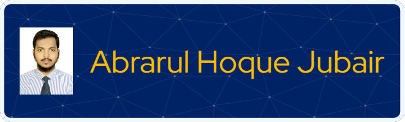

  
  <h2>👋 Welcome to <a href="https://abrarul.netlify.app" target="_blank">Abrarul's</a> Git Profile 👋 </h2>

        

            
        

        
    

  <!--    -->
 

# 📫 REACH ME

 

# CAREER OBJECTIVE

  Looking for the job of Entry Level Web Developer. To join the team in implementing user interaction following client-approved mock-ups, such as wireframes, visual design         comprehensive layouts, and prototypes. Bringing a keen eye for details, strong ability to implement mock-ups, and understanding of great user experience design; More than 01 year experience in visual UI / front-end development work, HTML5, CSS3, Bootstrap, jQuery, JavaScript, ReactJS, Matrial UI and WordPress customization.
 

# LANGUAGE & SKILLS

  
  
  
  
  
  
  
  
  
  
  
  
  
  
  
   

# Most Used Language

# Github Stats

